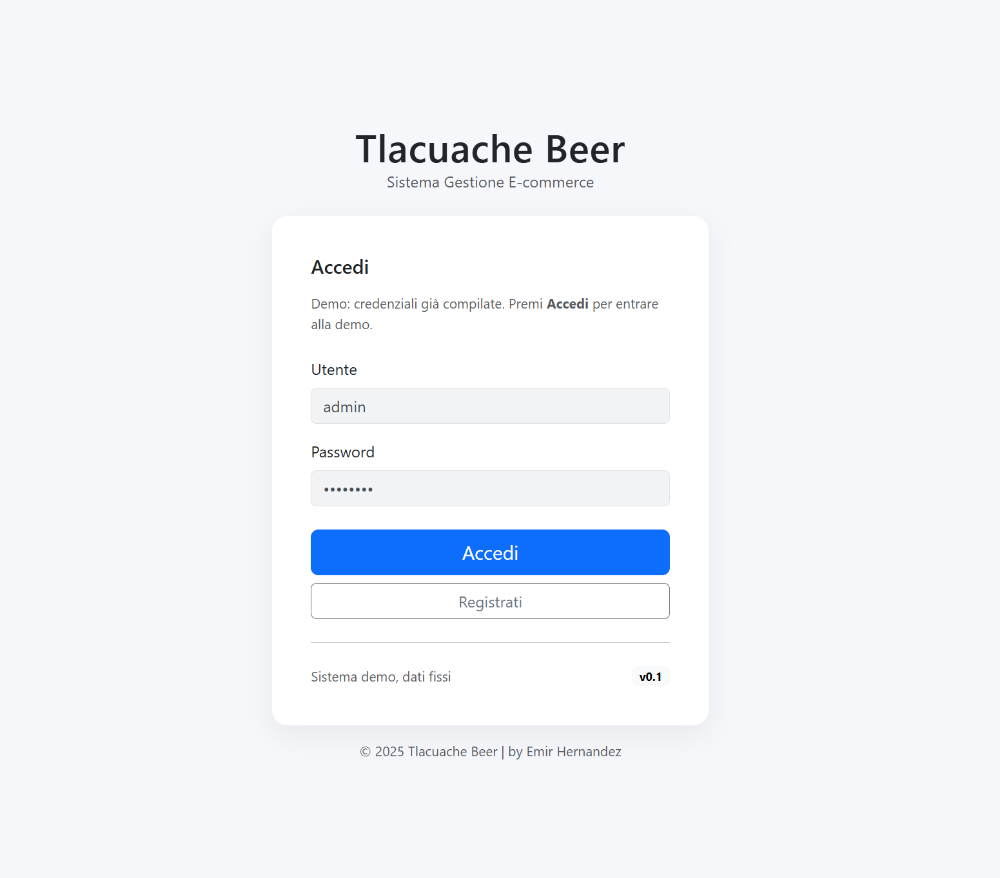
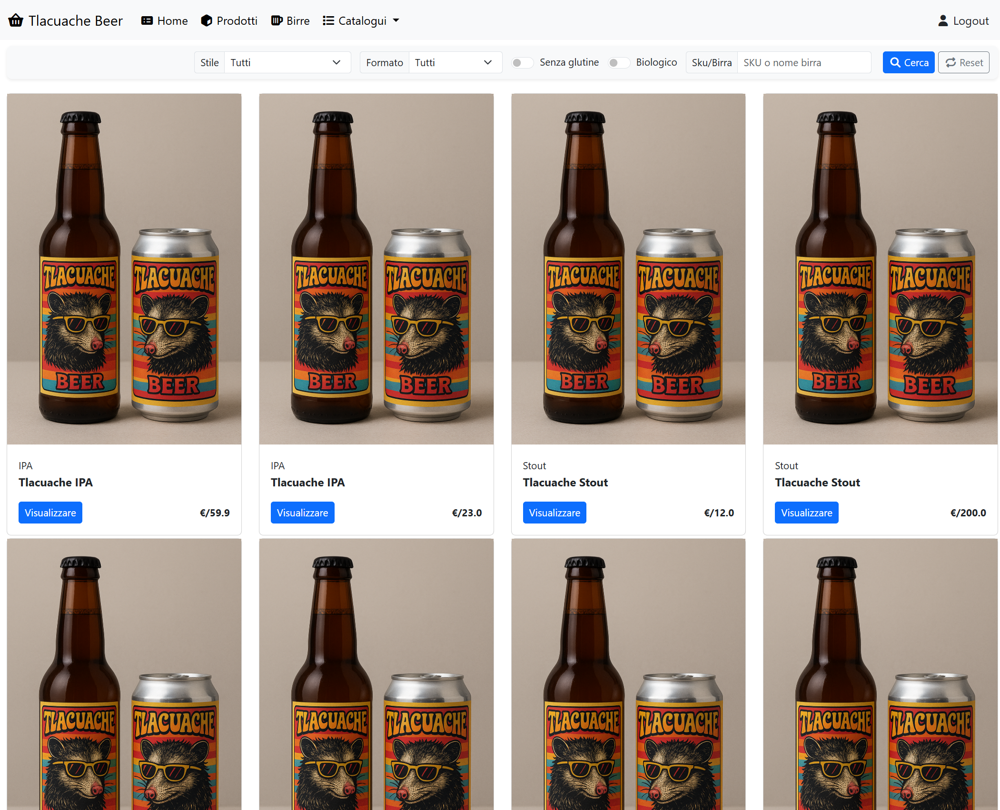
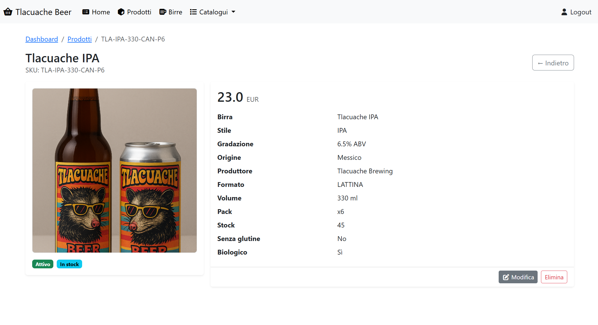
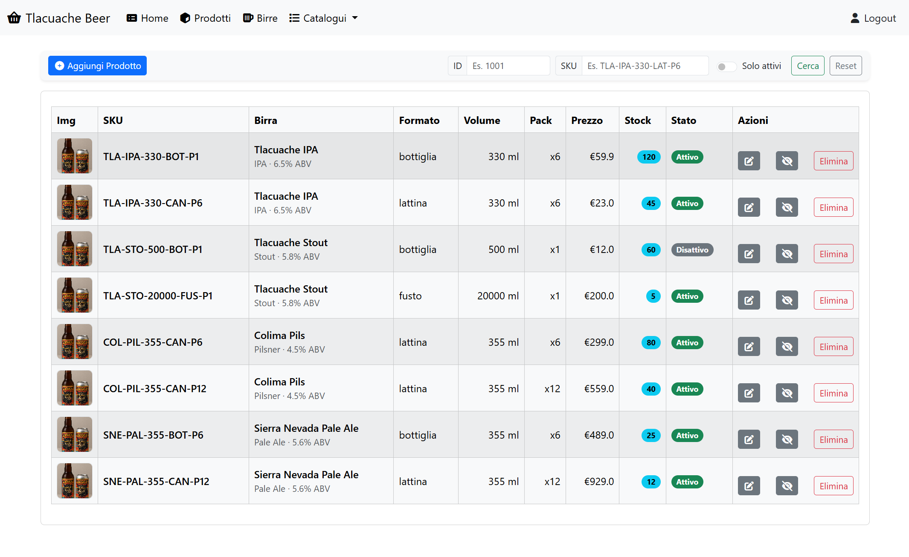
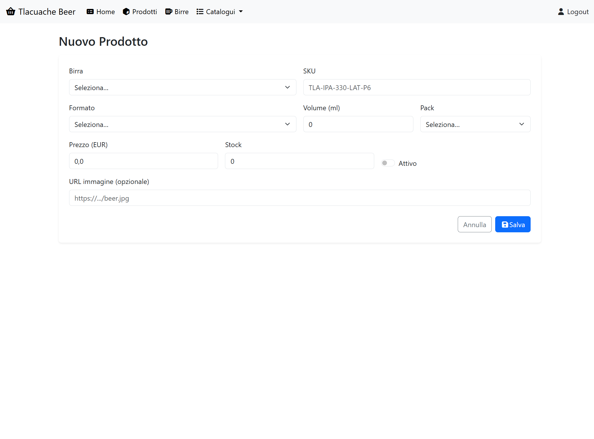
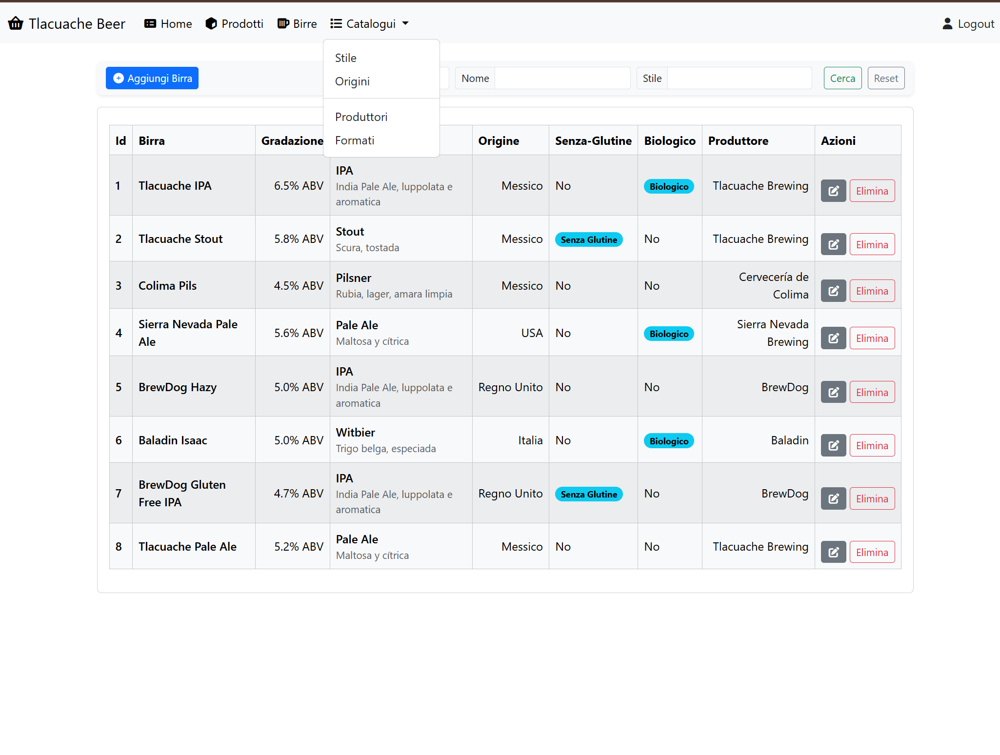

# Tlacuache Beer - E-commerce (Demo)

Aplicazione web **CRUD** per la gestione di un catalogo prodotti di e-commerce (birre artigianali).
Progetto sviluppato con **Jakarta EE + JSP/Servlet + JDBC** e un **connection pool**


## Tech Stack
- Java 21
- Apache Tomcat 10.1
- Maven (packaging: `war`)
- JSP/JSTL, Servlets (Jakarta)
- MySQL 8.4
- DBCP2 (pool di connessioni JDBC)
- Bootstrap 5 (UI)

## Funzionalità
- Inizio (demo login)
- Home con barra di navigazione e filtri
- Lista prodotti con tabella 
- Inserimento e modifica prodotti tramite form
- Eliminazione prodotti con conferma
- Ricerca con filtri
- Configurazione connessione DB tramite `config.properties` (non hardcoded)

## Screenshots app

*Pagina iniziale con login demo*


*Pagina home con barra di navigazione e filtri*


*Pagina detagli del prodotto*


*Tabella dei prodotti*


*Form per aggiungere / modificare prodotto*


*Menu dei cataloghi*

## Configurare database MySQL
```sql
CREATE DATABASE tlacuache_beer;
CREATE USER 'admin'@'localhost' IDENTIFIED BY 'root';
GRANT ALL PRIVILEGES ON tlacuache_beer.* TO 'admin'@'localhost';
FLUSH PRIVILEGES;
```

## Configurare credenziali

- Copiare il file di esempio:
```bash
cp src/main/resources/config.properties.example src/main/resources/config.properties
```
- Modificare `config.properties` con le proprie credenziali MySQL:
```properties
DB_HOST=localhost
DB_PORT=3306
DB_NAME=tlacuache_beer
DB_USER=admin
DB_PASSWORD=root
```


## Script SQL
### Esempio di importazione schema e dati
```bash
mysql -u tlacuache -proot tlacuache_beer < docs/sql/schema.sql
mysql -u tlacuache -proot tlacuache_beer < docs/sql/seed.sql
```


## Autore
Emir Hernandez
- Progetto didattico - sviluppo di applicazioni web con Java

## Licenza
- Uso didattico / demo - utilizzo libero per fini accademici e di apprendimento